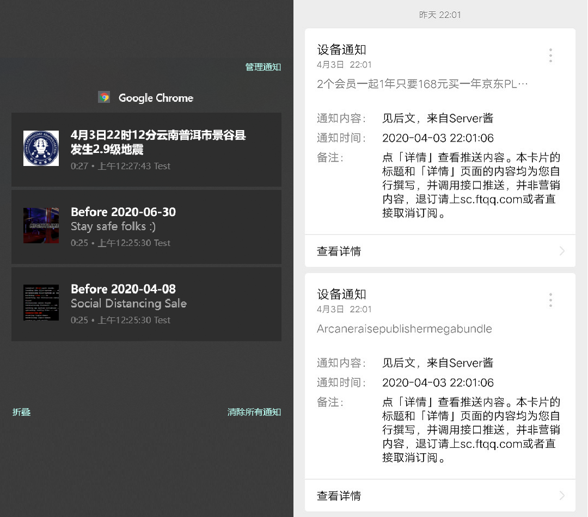

# Gloria-Code-Generator（Gloria代码生成器）

[](https://github.com/RichardLitt/standard-readme)

简体中文 | [English](./README_EN.md) 

[Gloria](gloria.pub)是**Chrome** 上的**可编程**网站通知聚合器，可通过自定义的代码定时抓取网站上的新内容弹出通知提醒。本项目意在进一步方便用户（包括代码基础差一些的用户）使用Gloria进行定制化的信息聚合抓取。使用Gloria插件可以节省逐页访问查看信息的时间，并自带Chrome的cookies，省去了为每一页面写爬虫的麻烦。使用此项目可以进一步懒人化地生成Gloria任务以及过滤器，实现0编程成本部署信息聚合抓取服务。

目前设计了共设计了两个生成器：**普通task生成器**和**reducer生成器**，通过此两者，可以实现定时抓取指定页面的通知并推送至PC、移动端等设备。可访问[此页面](https://gloria.pub/tasks)进一步添加更多已实现的任务或是贡献生成的任务。在PC端和微信的工作效果如下图所示：



## 目录

- [背景](#背景)
- [安装](#安装)
- [使用](#使用)
- [相关仓库](#相关仓库)
- [维护者](#维护者)
- [如何贡献](#如何贡献)
- [使用许可](#使用许可)

## 背景

发现Gloria这个宝藏插件后，我编写了许多通知脚本并自行使用，深感实用。Gloria官方的[教程](http://docs.gloria.pub/)给出了Gloria插件的可定制项，按我个人的理解总结说来就是任务和过滤器。其中任务可以同时存在多项，各自有各自的线程，互不污染；过滤器主要负责对抓取来的信息进行过滤，选取有价值的条目进行推送。由于这两部分代码都是以javascript的形式注入到插件里的，因此在这两部分代码中可以进一步夹带私货，比如加入fetch语句实现get/post请求，从而实现同步推送通知到其他设备的功能。

我写了许多个任务，并且找了很多家做数据同步的提供商，最后将Gloria定制成为了节省我精力的Chrome插件。我还将Gloria部署至我的windows服务器，以实现在24小时推送通知到移动端（如果有频道的API，还可以实现一对多推送）。但当我尝试将这一利器推荐给我的朋友们的时候，我发现他们对这种较依赖编程的插件有些难以接受。因此我使用python写了这个Gloria代码生成器。

## 安装

* **有python3环境**

  使用git克隆或者直接下载zip即可

```
git@github.com:BHMulberry/gloria_code_generator.git
```

* **无python3环境**

  下载[release里的exe版本](https://github.com/BHMulberry/gloria_code_generator/releases)，或者[下载安装python](https://www.python.org/)，打开新世界的大门

## 使用

### task生成器

目前版本的task生成器只支持基本的通知，比如抓取某一通知栏内的通知。使用task生成器生成task代码需要确定以下几个变量（这里以抓取[中国地震局](https://www.cea.gov.cn/cea/xwzx/369242/index.html)页面信息播报栏为例）：

`WEB_PAGE`: 目标页面的地址，即`'https://www.cea.gov.cn/cea/xwzx/369242/index.html'`

`TARGET_DIR`: 目标通知的盒子模型位置，使用浏览器的审查元素功能即可看到，这里为`'.listNews.pagelib ul li'`

`URL_ROOT`: 目标通知链接的前缀，在审查元素中如果看到目标通知的链接是不完整的，那么需要在获取的每个目标链接处补上前缀，如果不确定前缀，可以直接点进去看一个目标通知的链接地址就可以知道了。这里为`https://www.cea.gov.cn`（如果目标通知的链接是完整的，这里设置为空''）

`ICON_URL`: 目标通知的图标，可以静态地选取通知页的logo（直接找到logo图片查看其地址填在这里即可），也可以动态地选取每条通知自带的图片链接，也可以不填（Gloria会发送带默认图标的通知）。这里使用中国地震局的静态logo作为通知的图标，即`'https://pic1.zhimg.com/50/v2-c66d7a89ec2cae81fd27e021111129f7_qhd.jpg'`

* **有python3环境**

  修改代码中的各个变量值以及保存的文件名后在命令行处执行

```
python generate_gloria_task.py
```

* **无python3环境**

  根据exe的提示一步步输入各变量值即可（也可粘贴）

生成代码后，使用记事本或者其他软件查看文本，将其全部复制，在【Gloria - 高级 - 测试任务代码】处粘贴生成的代码，点击测试按钮进行测试，Chrome会进行测试的通知推送，如果能收到目标通知，即为成功。测试成功后在【Gloria - 任务 - 右下角加号】处粘贴代码，点击下一步，设置好定时执行的周期即可。

### reducer生成器

reducer生成器目前仅支持在过滤器中增加fetch操作，将抓取到的通知发送至指定链接，默认使用POST请求。由于不同的数据同步/分发服务提供商规定的请求格式不尽相同，所以如果要使用不同的提供商的API，请修改`./templates/fetch_url.tmpl`这一模板文件。如果需要添加通知过滤规则，请修改`./templates/gloria_reducer.tmpl`这一模板文件（默认带的tmpl是笔者自用的server酱的模板）。目前功能还有待进一步开发。

* **有python3环境**

  修改代码中的各个变量值以及保存的文件名后在命令行处执行

```
python generate_gloria_reducer.py
```

* **无python3环境**

  根据exe的提示一步步输入各变量值即可（也可粘贴）

## 相关仓库

* [Gloria](https://github.com/BlackGlory/Gloria/) - 本项目使用到的Gloria插件
* [Node-ServerChan](https://github.com/xfoxfu/node-ServerChan) - 本项目用于推送至微信端使用的[Server酱](http://sc.ftqq.com)的Node.js SDK

## 维护者

[@BHMulberry](https://github.com/BHMulberry)

## 如何贡献

娱乐项目，欢迎提PR或者issue！

如果编辑readme文件，请遵循[standard-readme](https://github.com/RichardLitt/standard-readme)规范。

## 使用许可

MIT © 2020 BHMulberry
